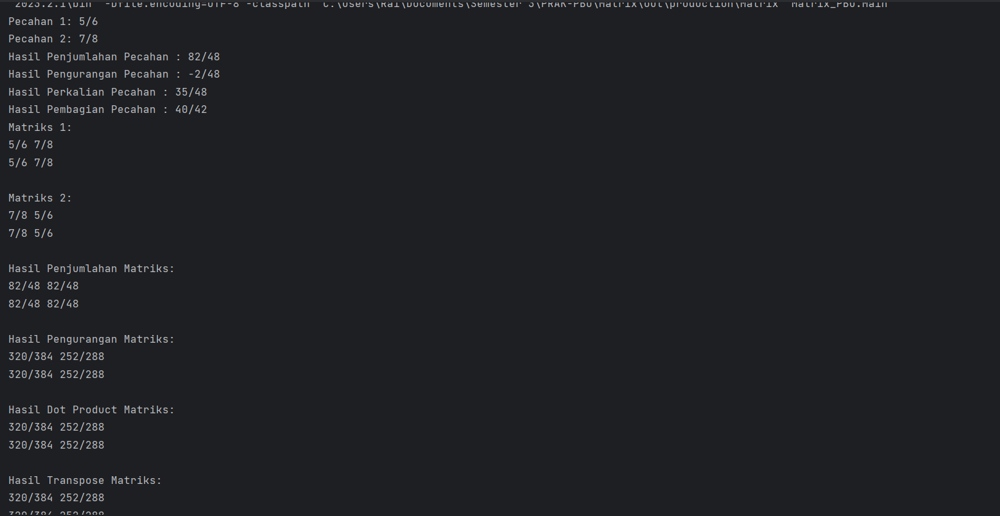

# PBO_A_Matrix
## Mohammad Raihan Azhar - 4522210048

### Class Pecahan
Class `Pecahan` memiliki operasi berikut:
- Penjumlahan (`tambah`)
- Pengurangan (`kurang`)
- Perkalian (`kali`)
- Pembagian (`bagi`)

### Class Matrik
Class `Matrik` memiliki elemen yang berupa pecahan (`Pecahan`) dan operasi berikut:
- Penjumlahan Matriks (`tambah`)
- Pengurangan Matriks (`kurang`)
- Perkalian Matriks (`dot`)
- Transposisi Matriks (`transpose`)
- Inversi Matriks (`inverse`)

### Capture Program

